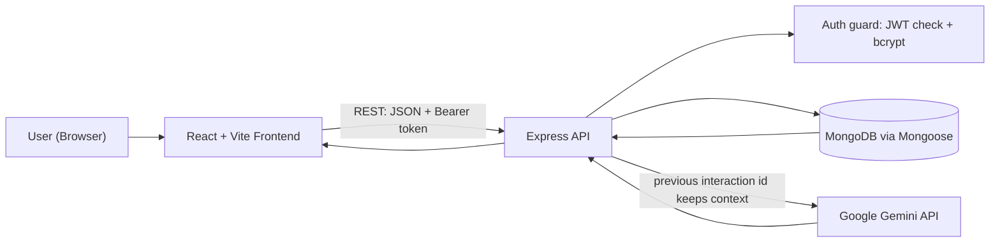
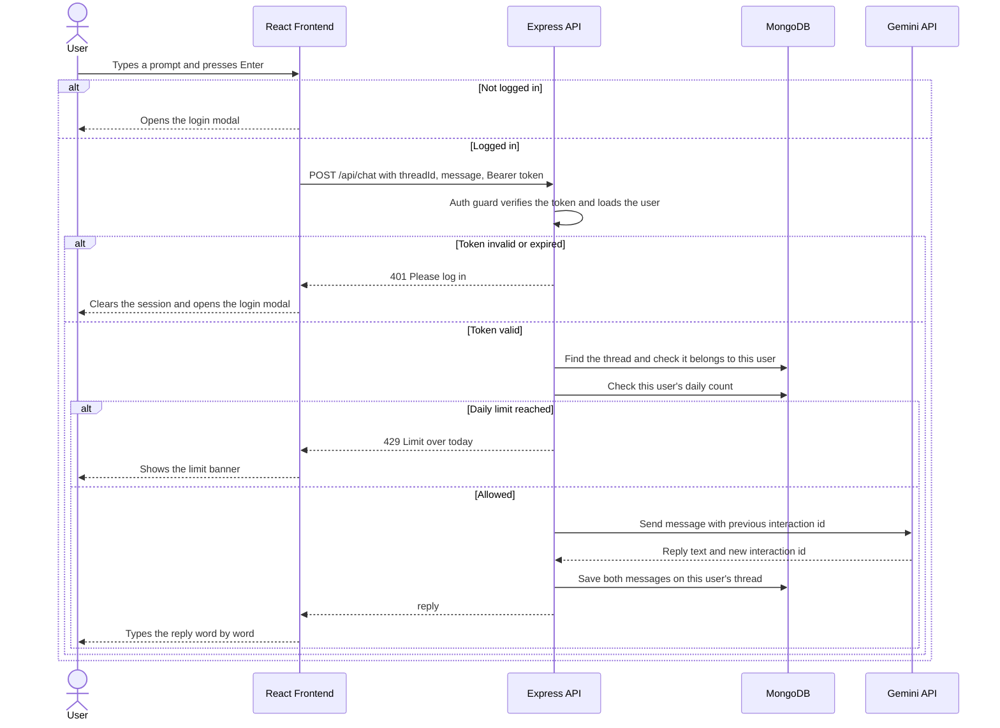
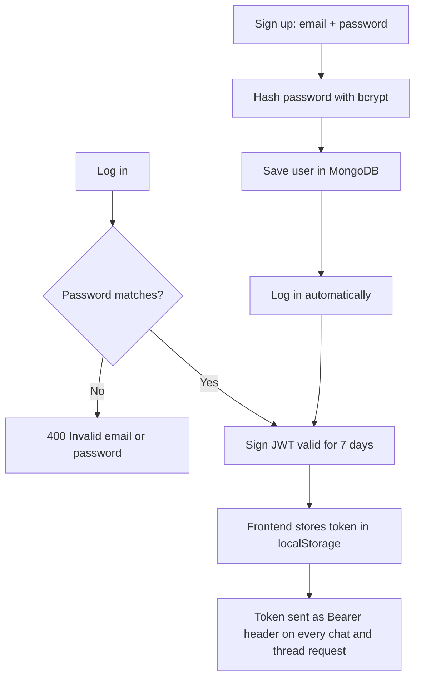
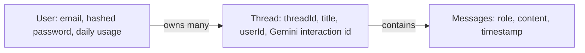
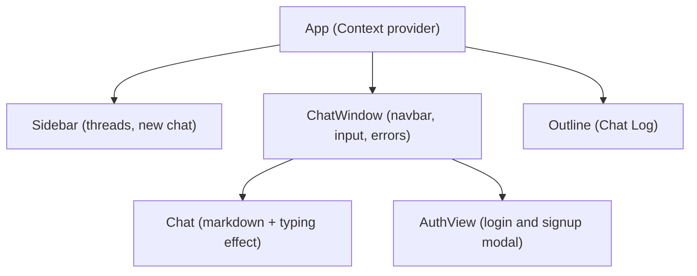

# **Zexabao.ai-** Idea to Intelligence
Your Own Friendly Interface Chat Bot 🐼

A full-stack AI chat application built with the MERN stack and the Google Gemini API. Users sign up, log in, chat with Gemini, and come back to their own saved conversations. Every account is private: chats, deletions and the daily limit belong to that user only. The UI uses a bamboo-panda theme and works on phones, tablets, laptops and desktops.

> **Live demo:** https://zexabaoai.vercel.app/


---

## What this project is

Zexabao.ai is a small but complete product, not a tutorial clone. It covers the full path from the browser to the AI model and back:

- A **React** single-page app with shared state, markdown rendering and a responsive layout.
- A **Node.js / Express** REST API with email and password auth (bcrypt + JWT), an auth guard on every private route, per-user data and a per-user daily limit.
- A **MongoDB** database modelled with Mongoose, where every thread has an owner.
- **Google Gemini** integration that keeps conversation context between messages.
- **Automated tests** on both sides: 21 UI tests (Vitest) and 50 API tests (Jest).

---

## Features

- Email signup and login with hashed passwords and JWT sessions (7 days)
- **Signup logs you in straight away**, with no extra login step
- **Private chats per user**: each account only sees, opens and deletes its own threads
- **Daily usage limit per user** (5 messages a day), stored on the user, with a clear limit banner
- Chat with Gemini, with context kept across a whole conversation
- Saved chat threads with a sidebar history
- **Chat Log panel** that lists your prompts and jumps to any earlier one
- Markdown answers with syntax-highlighted code blocks
- Word-by-word typing effect, and a stop button that cancels the request
- Expired logins, server errors and network failures show friendly messages, and an expired login opens the login box
- Fully responsive: the sidebar becomes a slide-in drawer on tablets and phones
- One bundled font (Sniglet), so the text looks the same on every browser

---

## Tech stack

| Layer | Technology |
|---|---|
| Frontend | React, Vite, React Context, react-markdown, highlight.js |
| Backend | Node.js, Express |
| Database | MongoDB, Mongoose |
| Auth | bcryptjs, JSON Web Tokens |
| AI | Google Gemini (`@google/genai`) |
| Testing | Vitest and React Testing Library (frontend), Jest and Supertest (backend) |

---

## How it works

### System overview



### What happens when you send a message



### Authentication



### Data model



### Frontend structure



---

## Project structure

```
Zexabao/
├── Frontend/
│   ├── src/
│   │   ├── App.jsx            # Context provider and layout
│   │   ├── Sidebar.jsx        # Thread list, new chat, delete
│   │   ├── ChatWindow.jsx     # Navbar, user menu, input, error handling
│   │   ├── Chat.jsx           # Messages, markdown, typing effect
│   │   ├── Outline.jsx        # Chat Log panel
│   │   ├── AuthView.jsx       # Login and signup modal
│   │   ├── MyContext.jsx      # Shared state
│   │   ├── responsive.css     # Breakpoints and font for every screen size
│   │   └── app.test.jsx       # UI tests
│   └── package.json
└── Backend/
    ├── Server.js              # Express app and DB connection
    ├── routes/chat.js         # Auth guard, auth, thread and chat endpoints
    ├── models/Threads.js      # Thread (with owner) and User schemas
    ├── utils/geminiai.js      # Gemini API wrapper
    ├── tests/                 # API tests
    └── package.json
```

---

## API reference

All routes are prefixed with `/api`. Routes marked **Bearer** need a valid login token in the `Authorization` header and only work on the logged-in user's own data.

| Method | Endpoint | Access | What it does |
|---|---|---|---|
| POST | `/signup` | Public | Creates an account (password stored as a bcrypt hash) |
| POST | `/login` | Public | Returns a JWT valid for 7 days |
| POST | `/chat` | Bearer | Sends a message, returns the Gemini reply, enforces the user's daily limit (429) |
| GET | `/thread` | Bearer | Lists the user's own threads, newest first |
| GET | `/thread/:threadId` | Bearer | Returns the messages of one of the user's threads |
| DELETE | `/thread/:threadId` | Bearer | Deletes one of the user's threads |

A missing, invalid or expired token returns `401`. Asking for another user's thread returns `404`.

---

## Security and privacy

- Passwords are hashed with bcrypt and never stored in plain text.
- Every private route goes through an auth guard that checks the JWT and loads the user.
- Threads and the daily limit are stored per user, and every database query is filtered by the logged-in user's id, so accounts never see each other's data.
- Secrets (database URL, JWT secret, API key) live in environment variables and are kept out of the repo by `.gitignore`.

---

## Run it locally

### Prerequisites
- Node.js 20 or newer
- A MongoDB database (a free [MongoDB Atlas](https://www.mongodb.com/atlas) M0 cluster works, or a local MongoDB)
- A Gemini API key from [Google AI Studio](https://aistudio.google.com)

### 1. Clone

```bash
git clone https://github.com/Abhayv273/zexabao.git
cd zexabao
```

### 2. Start the backend

```bash
cd Backend
npm install
```

Create `Backend/.env`:

```env
PORT=8080
MONGODB_URI=your_mongodb_connection_string
JWT_SECRET=any_long_random_string
GEMINI_API_KEY=your_gemini_api_key
```

Then run:

```bash
node Server.js
```

You should see `Server is listing on 8080` and `Connected to Database!`.

### 3. Start the frontend

In a second terminal:

```bash
cd Frontend
npm install
```

Create `Frontend/.env`:

```env
VITE_BACKEND_URL=http://localhost:8080
```

Then run:

```bash
npm run dev
```

Open the address Vite prints, usually `http://localhost:5173`. Create an account (you are logged in right away) and send a message. To check the privacy, open a second account in a private window and confirm it starts with an empty chat list.

---

## Run the tests

The tests use mocks, so they need no database, no API key and no `.env` file.

**Frontend** (21 UI tests, Vitest and React Testing Library):

```bash
cd Frontend
npm test
```

They check: login gating, sending a message with the Bearer token, the 401, 429, 500 and network-error paths, the user menu closing on outside click, the login flow, signup logging you in straight away, the mobile drawer, opening and deleting threads, and that logout clears the thread list and the limit banner so the next user starts clean.

**Backend** (50 API tests, Jest and Supertest):

```bash
cd Backend
npm test
```

They check: signup and login (hashed passwords, JWT contents and expiry), the auth guard on every private route (no token, bad token, expired token, deleted user), thread routes scoped to the owner, `/chat` (new and existing threads, context passing, another user's thread refused, the per-user daily limit and its daily reset, Gemini failures), the Mongoose schemas including the required thread owner, and the Gemini wrapper.

---

## Responsive design

| Screen width | Layout |
|---|---|
| Above 1280px | Sidebar, chat and Chat Log side by side |
| 1025 to 1280px | Slightly narrower Chat Log |
| 901 to 1024px | Narrower sidebar and Chat Log |
| 900px and below | Sidebar becomes a slide-in drawer opened from a menu button |
| 600px and below | Chat Log hidden to give the chat full width |

---

## Deployment

The app is built to run on free tiers: the frontend on Vercel, Netlify or Cloudflare Pages, the backend on Render, and the database on MongoDB Atlas. Set `VITE_BACKEND_URL` on the frontend host, and `MONGODB_URI`, `JWT_SECRET` and `GEMINI_API_KEY` on the backend host. Redeploy the backend whenever backend code changes.

---

## Roadmap

- Rate limiting and stronger input validation on signup
- Streaming replies from Gemini
- Model switcher in the UI
- Refresh tokens and httpOnly cookies instead of localStorage

---

## Author

**Abhay Verma**,(Software Developer)<br>
" Open to opportunities || Consider leaving a ⭐ if you find this valuable "

- GitHub: [github.com/Abhayv273](https://github.com/Abhayv273)
- LinkedIn: [linkedin.com/in/abhay-verma-36488325b](https://www.linkedin.com/in/abhay-verma-36488325b)
